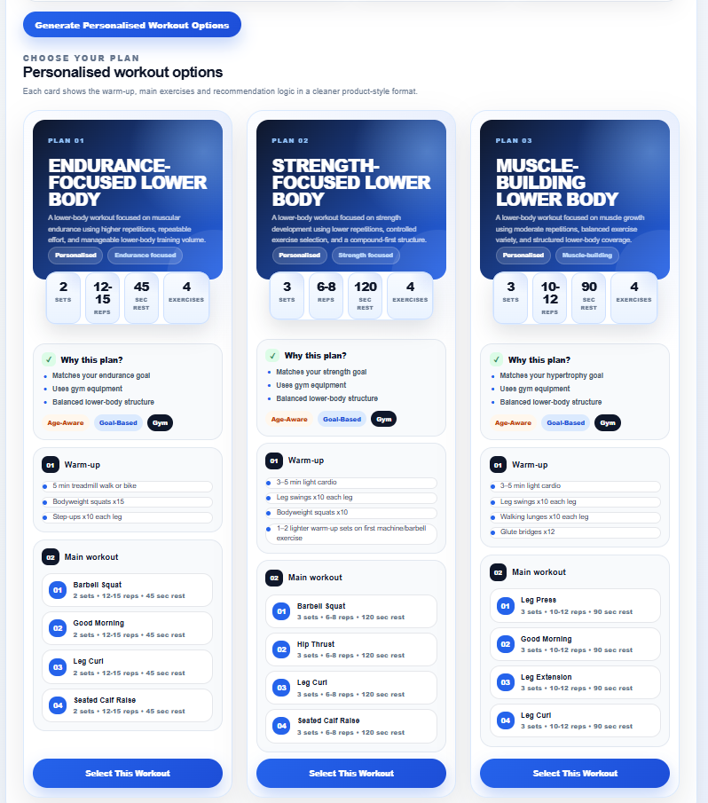
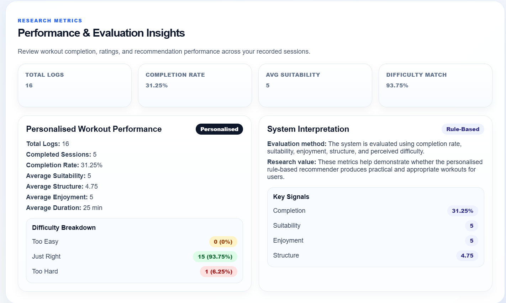

# Lower-Body Workout Recommender System

A full-stack personalised fitness web application that generates lower-body workout plans based on user-specific attributes such as fitness level, goals, equipment, age, injury status, and workout history.

This project was developed as a final-year Computer Science project to demonstrate how a rule-based recommender system can outperform generic online workout plans through intelligent personalisation and safety-aware logic.

---

## Live Demo

https://4th-year-project-five.vercel.app

Test Login:
- Username: chris  
- Password: 123456  

---

## Screenshots

(Add screenshots here before submission)

  
  

---

## Project Overview

Most online fitness plans provide generic workouts that do not adapt to individual needs.

This system addresses that limitation by generating personalised lower-body workouts using structured rules and user data.

Each workout is tailored using:

- Fitness level (Beginner, Intermediate, Advanced)
- Training goal (Strength, Hypertrophy)
- Available equipment (Gym, Dumbbells, Bodyweight)
- Age considerations
- Injury constraints (e.g. knee, back)
- Previous workout feedback

---

## Key Features

- User authentication (JWT-based login and registration)
- Personal profile setup
- Rule-based workout recommendation engine
- Multiple personalised workout options
- Exercise library
- Workout history tracking
- Evaluation and feedback system
- Progress insights
- Comparison with a generic online workout
- Clean, modern React user interface

---

## Recommender System Logic

This system uses a knowledge-based (rule-based) approach rather than machine learning.

Example logic includes:

- Avoiding high-impact exercises for users with knee injuries
- Reducing spinal load for users with back issues
- Adjusting intensity based on fitness level
- Selecting exercises based on available equipment
- Applying safer structures for older users
- Using previous feedback to influence future recommendations

This approach ensures safer, more relevant, and more personalised workout plans compared to generic alternatives.

---

## Comparison with Generic Workouts

| Feature | This System | Generic Workout |
|--------|------------|----------------|
| Personalisation | Yes | No |
| Injury Awareness | Yes | No |
| Age Adaptation | Yes | No |
| Equipment Adaptation | Yes | No |
| Progress Tracking | Yes | No |

This comparison is included within the system to demonstrate practical value and justify the recommender approach.

---

## Tech Stack

Frontend:
- React
- JavaScript
- CSS

Backend:
- Node.js
- Express.js

Database:
- MongoDB (Mongoose)

Authentication:
- JSON Web Tokens (JWT)
- bcrypt password hashing

Deployment:
- Frontend hosted on Vercel
- Backend hosted on Render

---

## Project Structure

/client  - React frontend  
/server  - Node/Express backend  

---

## Installation and Setup

1. Clone the repository:

git clone https://github.com/christopherv21/4th-year-project.git  
cd 4th-year-project  

---

2. Setup Backend:

cd server  
npm install  
npm run dev  

Create a .env file in the /server directory:

MONGO_URI=your_mongodb_connection  
JWT_SECRET=your_secret  
JWT_EXPIRES_IN=7d  
CLIENT_URL=http://localhost:3000  

---

3. Setup Frontend:

cd client  
npm install  
npm start  

---

## Evaluation and Results

Users submit feedback after each workout, including:

- Completion status
- Suitability rating
- Structure rating
- Enjoyment rating
- Difficulty feedback
- Duration
- Notes

This data is used to track progress, improve recommendations, and support evaluation of the system.

---

## Project Goals

- Demonstrate a working recommender system
- Improve workout safety and personalisation
- Provide a better alternative to generic fitness plans
- Deliver a product-level user experience
- Achieve a high-grade final-year project

---

## Future Improvements

- Add exercise images for improved user experience
- Provide weight recommendations for gym users
- Enhance progress analytics and visualisations
- Expand the exercise database
- Improve adaptation over time using user data

---

## Author

Christopher Vrancean  
Final Year Computer Science Student  

---

## License

This project is for academic purposes.
